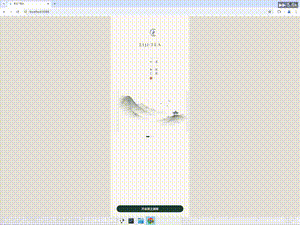

# 李记·TEA · LIJI·TEA

东方茶生活美学移动应用(Flutter)。墨绿 + 烫金 + 米白的留白美学,思源宋体标题,4pt 间距体系。当前为脚手架阶段:首页 + 商品详情,使用静态示例数据(暂无后端)。

## 演示 / Demo

<p align="center">
  
</p>

完整高清录屏(含测试标注):[docs/demo.mp4](docs/demo.mp4)

演示流程:首页 → 点商品进入详情 → 选择规格 → 收藏 → 加入购物车(提示)→ 底部导航切换。

账户/设置页演示(订单 / 地址 / 积分 / 客服 / 设置 / 登录 / 消息通知):[docs/account-screens-demo.mp4](docs/account-screens-demo.mp4)

## 功能

- **设计 token**(`lib/theme/`):颜色 / 字体(思源宋体 + 思源黑体)/ 间距(4pt)/ 圆角
- **底部导航 5 tab**:首页 / 分类 / 茶文化 / 购物车 / 我的
- **首页**:LIJI·TEA 标志、按时间变化的问候语、4 个快捷入口、今日推荐商品卡、茶语引用
- **商品详情**:返回 / 收藏 / 分享、属性栏(采摘 / 产地 / 口感 / 香气)、产品介绍、规格选择、底部价格 + 加入购物车
- 4 个示例商品(龙井 / 碧螺春 / 安吉白茶 / 山水茶壶)

## 本地运行

需要 Flutter SDK(stable)。

```bash
flutter pub get
flutter run            # 接手机 / 模拟器
# 或在浏览器预览:
flutter run -d chrome
```

## 项目结构

```
lib/
  main.dart                 # 入口
  app.dart                  # 5-tab 底部导航 Shell
  theme/                    # 设计 token(颜色/字体/间距/圆角/主题)
  screens/                  # 首页、商品详情、占位页
  widgets/                  # 复用组件(商品卡、按钮、图片等)
  models/                   # 数据模型(TeaProduct)
  data/                     # 静态示例数据
```

## 测试

端到端黄金路径(首页 → 商品详情 → 选规格 → 收藏 → 加入购物车 → 底部导航)已验证,6 项全部通过(见上方演示)。
